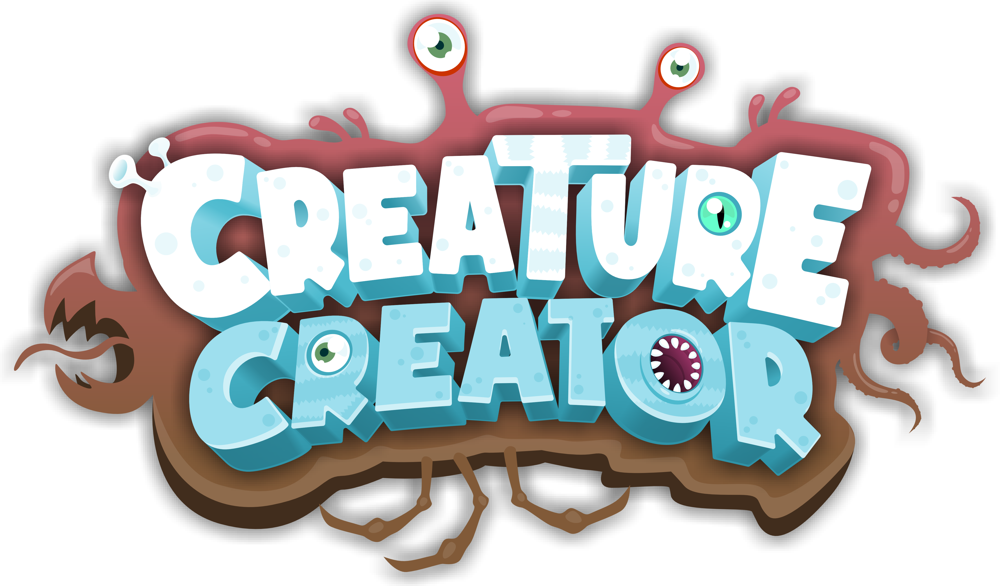

<b><a href="https://www.youtube.com/watch?v=FgXHPeQhEXo">Watch trailer</a> | <a href="https://bit.ly/creature-creator-demo">Try demo (itch.io)</a> | <a href="https://store.steampowered.com/app/1990050/Creature_Creator">Download game (Steam)</a></b>

Create your own creatures to explore online worlds with friends and unlock new parts to upgrade your stats and abilities!

The creation tool consists of three different modes: build-, paint- and play mode. In build mode, you can customize the shape of your creature by manipulating its spine and attach transformable body parts. Altering your creature then changes its statistics (e.g., weight, speed, health etc.) and attaching certain body parts gives it special abilities (e.g., flying, swimming, biting etc.). In paint mode, you can change the color of your creature’s body and attached body parts, as well as the pattern and texture of your creature’s skin. When you’re finished designing your creature, enter play mode to bring it to life!

---

## Getting Involved

Join the community Discord server and follow me on YouTube and Twitter to stay updated on the latest developments. Once you're a member, there are many ways you can get involved and contribute to this open source project:

1. If you're a **player**, you can contribute by submitting bug reports, feedback, and suggestions through [this](https://github.com/daniellochner/creature-creator-game/issues) GitHub repository. This is a great way to get involved even if you don't have any game development experience.
2. If you're an **artist**, you can design new body parts for the game using any 3D modeling software and submit them on the Discord server. Our developers will then import your models into the game.
3. If you're a **developer**, you can get started by following these steps:
    1. Fork and clone this repository to your local hard drive using GitHub desktop.
    2. Drag and drop the paid-for assets into the "Assets/Plugins/External/Paid/" directory. Note that this project uses several paid assets from the Unity Asset Store that cannot be included in this public repository. If you can confirm that you have purchased all the assets listed [here](https://assetstore.unity.com/lists/list-280315), an existing developer can send you a zip file of this directory.
    3. Open the project in Unity Hub and wait for the necessary packages to import (this may take a while).
    4. Sign up for Unity's Gaming Services, which are necessary for testing the multiplayer features.
    5. Log in to your account in the Unity editor and go to "Edit > Project Settings > Services" to create a Unity Project ID and link it to the project.
    6. Go to "Window > Startup" and drag the window into the editor to force the startup scene on play. This is used to force-enter the startup scene on play.
    7. Finally, due to a bug in Unity's Netcode for GameObjects library, testing in the Unity editor may require the use of the "Network Prefab Fix" window, located in "Window > Networking". All network objects must be included in this list.

We welcome and appreciate contributions from anyone, regardless of your expertise. Contributions are managed through pull requests, which we will need to confirm before they are applied to the main branch.

## License

Creature Creator and related products by Daniel Lochner have been open-sourced under the [GNU General Public License v3.0](./LICENSE.md), however, contributions made by members of the community are usable at the discretion of their author(s).

> Permissions of this strong copyleft license are conditioned on making available complete source code of licensed works and modifications, which include larger works using a licensed work, under the same license. Copyright and license notices must be preserved. Contributors provide an express grant of patent rights.

## Support

If you have purchased the game on Steam, then you have already contributed to its development. ♥ If you would like to further support this project, however, then you are welcome to make a donation through [Ko-Fi](https://ko-fi.com/daniellochner) or become a GitHub sponsor. Your support is greatly appreciated!

## Disclaimer
This project is not affiliated, associated, authorized, endorsed by, or in any way officially connected to Spore, EA, or any of its subsidiaries or affiliates.
